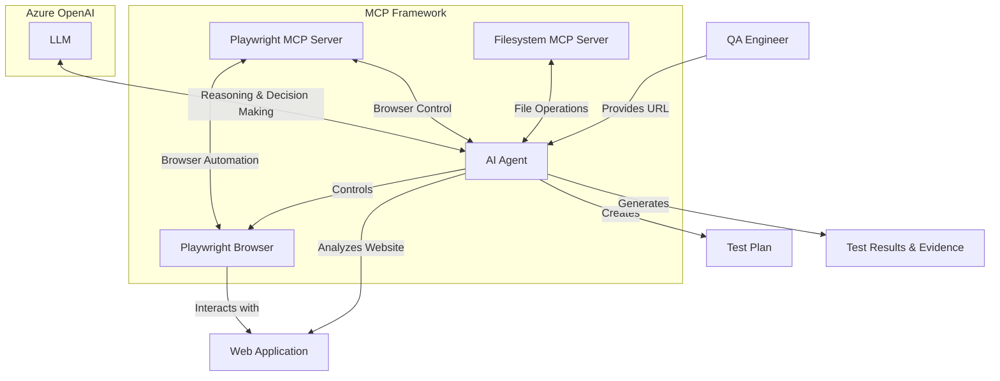

# AI-Powered QA Automation

This project integrates AI agents with Playwright and file server to create autonomous QA testing capabilities for web applications.

## Overview

The AI-Powered QA Automation tool leverages the Model Context Protocol (MCP) and Large Language Models (LLMs) to enable intelligent, autonomous testing of web applications or single page web applications. Built on the emerging OpenAI Agent SDK, this implementation showcases how AI can be integrated into QA workflows. The system uses an AI agent that can understand web application functionality, create test plans, execute tests using Playwright, and generate detailed test reports - all with minimal human intervention.

This project serves as a conceptual implementation that demonstrates the potential of AI-driven testing. As both the OpenAI Agent SDK and MCP continue to evolve, this framework can be extended and customized by teams based on their specific testing needs and requirements.

## Benefits

- **Autonomous Testing**: Reduces manual QA effort by enabling AI to plan and execute tests
- **Coverage**: AI agents intelligently identify key features and create thorough test plans
- **Self-documenting**: Automatically generates test plans and detailed results with evidence in the form of screenshots
- **Adaptability**: Has potential to work with any web application without requiring custom test scripts
- **Reduced Maintenance**: Less code to maintain compared to traditional automation frameworks driven by heavy coding and maintenance overhead
- **Faster Testing Cycles**: Accelerates testing phases, supporting agile development

## Solution Structure

```
.
├── .env                   # Environment variables configuration
├── .env.template          # Template for environment variables
├── playwright/            # Main project directory
│   └── llm-automation/    # AI automation implementation
│       ├── program.py     # Main Python script for AI testing
│       ├── agent_instructions.txt # Instructions for the AI agent
│       └── node_modules/  # JavaScript dependencies
```

## Technical Architecture



### How Our AI-Powered Testing Platform Works

1. **QA Engineer Initiates Testing**
   - You provide the target website URL
   - The system begins the automated testing process

2. **AI Agent Execution Flow**
   - Analyzes the website to identify testable components and functionality
   - Drafts a test plan based on the analysis
   - Orchestrates browser interactions through Playwright MCP server
   - Captures evidence through screenshots and interaction logs
   - Compiles detailed test results and documentation
   - Saves the test results and evidence using the filesystem MCP server

3. **Technical Components**
   - **Filesystem MCP Server**: Manages file operations for test artifacts, evidence, and reports, enables local file system access
   - **Playwright MCP Server**: Facilitates browser automation and UI interaction
   - **Azure OpenAI**: Powers the reasoning engine that drives test strategy and execution

4. **Data and Control Flow**
   - The AI reasoning engine determines test scenarios → Playwright executes precise browser interactions → Results are documented through the filesystem server
   - This architecture eliminates repetitive script maintenance while maintaining professional testing standards

## How It Works

1. **Analysis Phase**: The AI agent explores the target web application / single page web application to understand its UI components functionality and features (can be done by the agent itself or by the user)
2. **Planning Phase**: Based on its analysis, the agent creates a detailed test plan covering identified features
3. **Execution Phase**: The agent uses Playwright through MCP to execute tests on the web interface
4. **Reporting Phase**: The agent documents test results with screenshots and generates a detailed report by leveraging another MCP server (filesystem based)

## Why This Matters for QA Automation Engineers

### Transforming the QA Role

The integration of AI in testing changes the role of QA automation engineers:

- **Strategic Focus**: Shift from writing test scripts to defining testing strategies and reviewing AI-generated plans
- **Higher-Level Quality Assurance**: Focus on quality objectives rather than implementation details
- **Complex Testing Scenarios**: Dedicate time to edge cases and complex scenarios while AI handles routine testing
- **Continuous Learning**: Stay current with AI capabilities to effectively supervise and leverage AI-powered testing

### Essential AI Knowledge for QA Engineers

- **Prompt Engineering**: Understanding how to guide AI agents through effective instructions
- **AI Capabilities & Limitations**: Knowing when to use AI vs. traditional testing approaches
- **Model Context Protocol (MCP)**: Understanding how AI interfaces with testing tools
- **AI Testing Evaluation**: Developing skills to assess the quality of AI-generated test plans and results

## Getting Started

1. Clone this repository
2. Copy `.env.template` to `.env` and fill in your Azure OpenAI credentials
3. Navigate to the `playwright/llm-automation` directory
4. Run `python program.py` to start the AI-powered testing

## Requirements
 - Refer to the requirements.txt file for the list of dependencies

## Future Enhancements

- Support for API testing
- Integration with CI/CD pipelines
- Test data generation capabilities
- Performance testing integration
- Cross-browser testing coordination
- Automated email notifications for test results
